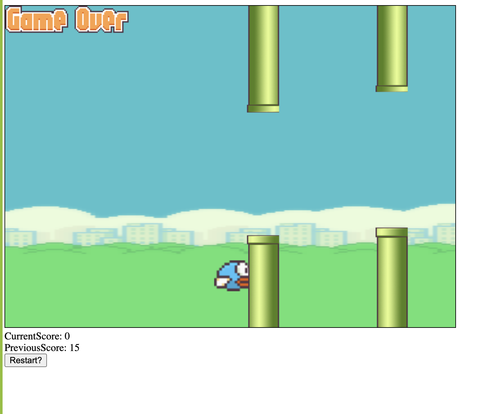

### Flappy Bird.

```
Simple flappy bird game in vanilla JS.
```

```
Features:
-Collision Detection.
- Movement
```

```
Improvements:
- Styling.
```

### Getting Started

```
View the index.html file in a live server with VS code extension.
```

### Flow for user.

## Game

`Game Page.`


### Built With

```
Vanilla- JS
```

### Authors

```
Manider Dheer.
Harpreet Singh.
```

### License

```
This project is licensed under the MIT License - see the LICENSE.md file for details
```
